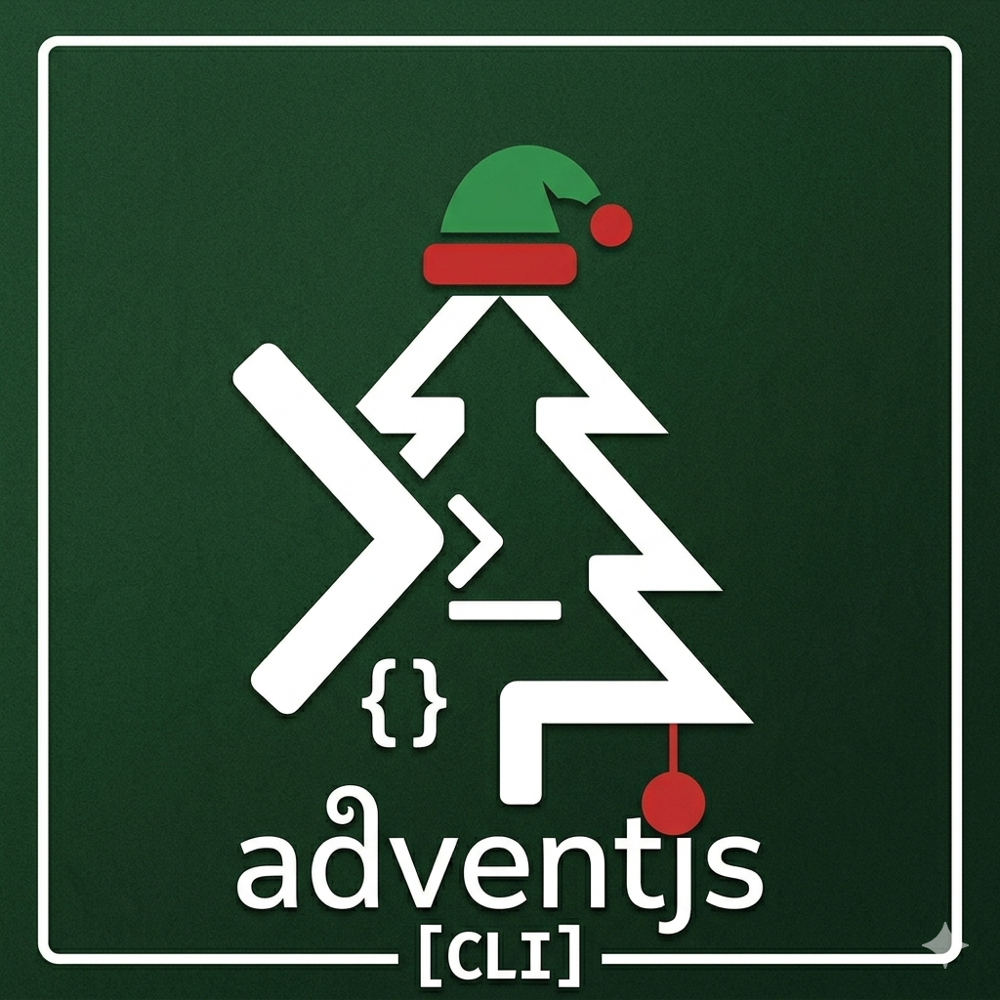

# 🎄 adventjs-cli



The all-in-one command-line tool for [AdventJS challenges](https://adventjs.dev/). Save hours of repetitive setup with a single command and focus on solving, not configuring.

- Generates a TypeScript solution template, problem docs, and unit tests
- Fully preconfigured environment with debugging, linting, formatting, and CI
- Consistent workflow every year, built from personal experience

## 👋 How to use it

### 1️⃣ Initialize your project

Start by initializing your AdventJS project:

```bash
npx adventjs-cli init
```

This command will guide you through a step-by-step setup.

The tool will create a new folder (`adventjs-YYYY`) with all necessary configuration files and a ready-to-use project structure.

### 2️⃣ Generate boilerplate for a specific day

Once your project is initialized, generate the starter files for any challenge day:

```bash
npx adventjs-cli g <day>
```

Replace `<day>` with the challenge day number (e.g., `1`, `5`, `25`).

**Example:**

```bash
npx adventjs-cli g 1
```

## 🔧 Dev docs

Follow [dev docs](docs/DEV.md) for more info.
